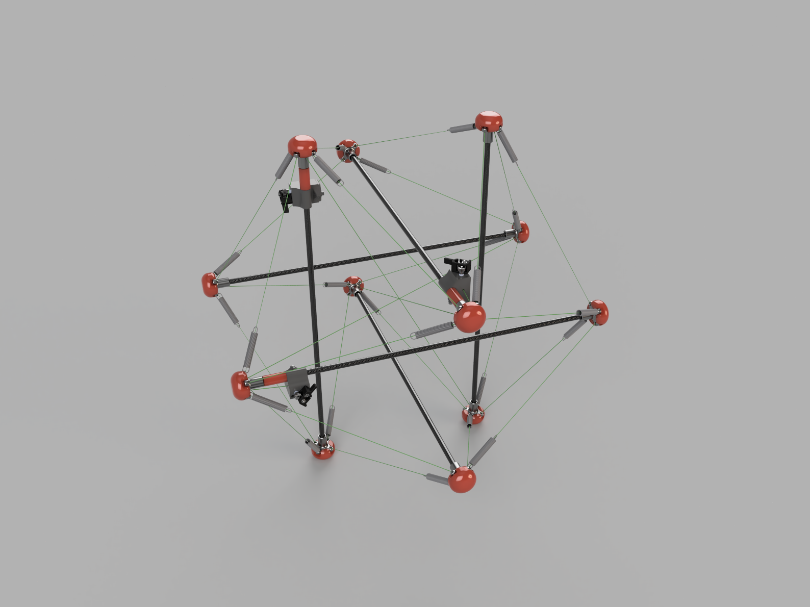
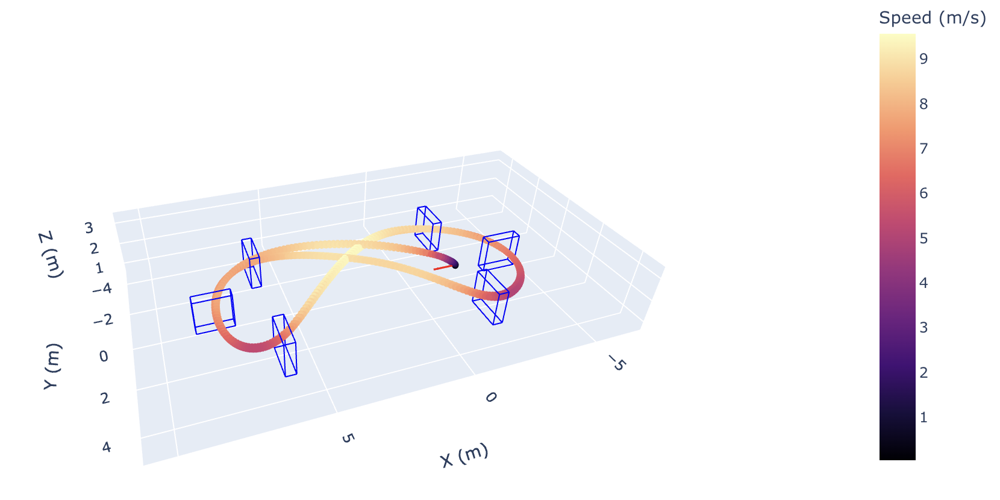
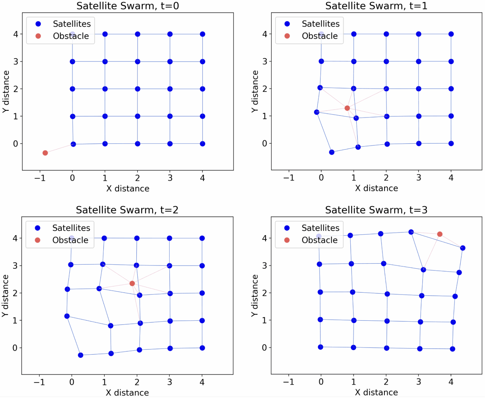
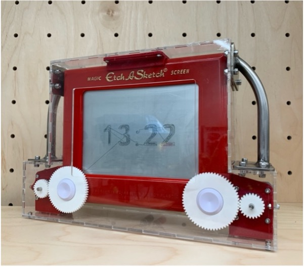

# 🚀 Project Portfolio

This repository showcases my work in robotics, systems and control. Here you'll find a collection of projects that highlight my engineering, programming, simulation, and problem-solving skills.

## 📌 About Me
I love to build things, and I'm deeply passionate about robotics, automation, and space. With experience across a range of programming language and robotics tools, I've put together this portfolio to demonstrate my expertise in:
- 🤖 **Robotics & Automation**
- 📊 **Simulation & Data Analysis**
- 🛠 **Control Systems**

## 📂 Projects

### 1️⃣ **High Jumping Tensegrity Robot for Space Exploration** 
🔹 **Description:** Steerable tensegrity based robotic created to enhance capability on the unstructrured terrain present on other planets.  
🔹 **Info:** [📂 View Project](./tensegrity_robot)  
 

---

### 2️⃣ **Zero-Shot Generalisation with Reinforcement Learning for Agile Drone Flight**
🔹 **Description:** Enhanced reinforcement learning to improve the ability of agile racing drone controllers to fly on unseen racetracks  
🔹 **Info:** [📂 View Project](./agile_drone_flight)  
 

---

### 3️⃣ **Automated Phone Spoofing Modem for Global Access**
🔹 **Description:** Device that allows me to use my Australian phone number from anywhere in the world (for free!)  
🔹 **Info:** [📂 View Project](./phone_spoofer)  
 

---

### 4️⃣ **Distributed Control for Satellite Collision Avoidance**
🔹 **Description:** Novel low computational cost controller with provable stability  
🔹 **Info:** [📂 View Project](./sat_collision_avoidance)  
 

---

### 5️⃣ **CNC Etch-A-Sketch Home Assistant**
🔹 **Description:** A fun home assistant device utilising a vintage children's toy as its display  
🔹 **Info:** [📂 View Project](./cnc_etchasketch)  
 

---

## 📬 Contact
📧 Email: jonathan.is.green@gmail.com  
🔗 LinkedIn: [Profile](https://www.linkedin.com/in/jonathanjkg/)    

Please reach out if you have any questions!
