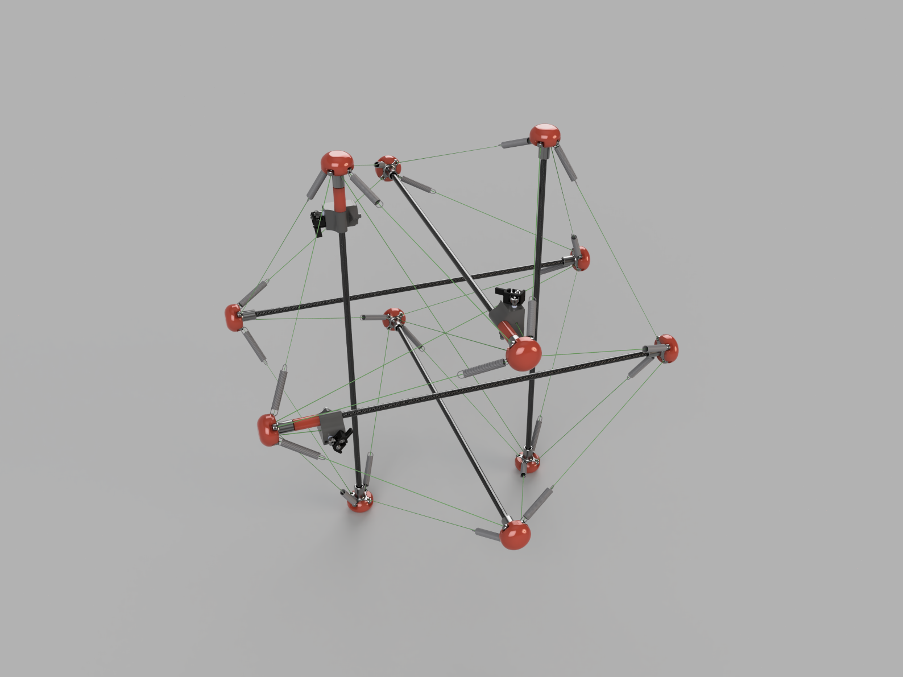
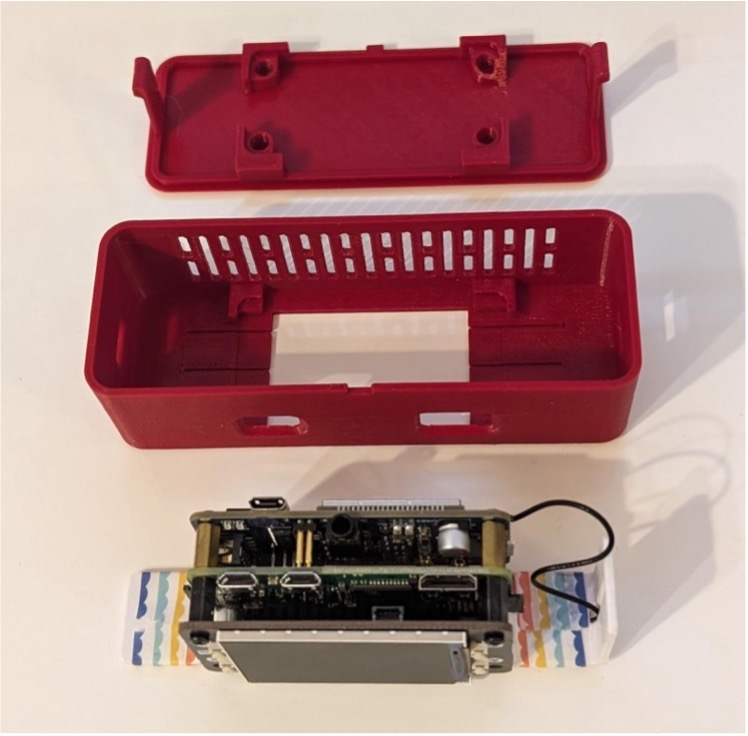

# 🚀 Projects Portfolio

This repository showcases my work in robotics, systems and control. Below, you'll find a collection of projects that highlight my engineering, programming, simulation, and problem-solving skills.

## 📌 About Me
I love to build things, and I'm deeply passionate about robotics, automation, and space. With experience across a range of programming language and robotics tools, I've put together this portfolio to demonstrate my expertise in:
- 🤖 **Robotics & Automation**
- 📊 **Simulation & Data Analysis**
- 🛠 **Control Systems**

## 📂 Projects

### 1ï¸âƒ£ **High Jumping Tensegrity Robot for Space Exploration** 
🔹 **Description:** Reimagine existing tensegrity based robotic structures to enhance capability on complex terrain and develop systems focussed on space exploration. With the Robotic Systems Lab at ETH Zurich.  
🔹 **Info:** [📂 View Project](./tensegrity_robot)  
 

---

### 2ï¸âƒ£ **Distributed Control for Satellite Collision Avoidance**
🔹 **Description:** Created a novel controller for satellites and proved that it had favourable properties  
🔹 **Info:** [📂 View Project](./sat_collision_avoidance)  
 

---

### 3ï¸âƒ£ **Automated Phone Spoofing Modem for Global Access**
🔹 **Description:** Built a device that would allow me to use my Australian phone number from anywhere in the world, for free  
🔹 **Info:** [📂 View Project](./phone_spoofer)  
 

---

### 4ï¸âƒ£ **Curriculum Learning for Robust Agile Drone Flight**
🔹 **Description:** Enhanced reinforcement learning to improve generalisation of agile drone flight controllers   
🔹 **Info:** [📂 View Project](./agile_drone_flight)  

---

### 5ï¸âƒ£ **CNC Etch-A-Sketch Home Assistant**
🔹 **Description:** Developed an electro-mechanical home assistant device utilising a vintage children's toy as its display  
🔹 **Info:** [📂 View Project](./cnc_etchasketch)  
 

---

## 📬 Contact
📧 Email: jonathan.is.green@gmail.com  
🔗 LinkedIn: [Profile]([https://linkedin.com/in/yourprofile](https://www.linkedin.com/in/jonathanjkg/))    

---
Feel free to explore and reach out if you have any questions! 🚀
