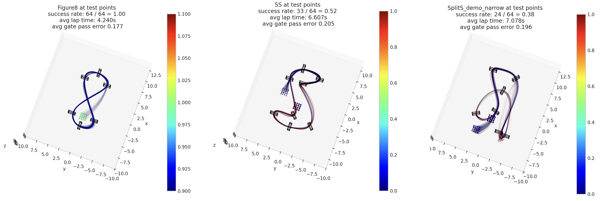

# 📌 Curriculum Learning for Robust Agile Drone Flight - IN PROGRESS

## 📖 Overview
Reinforcement learning-based controllers have demonstrated remarkable success in enabling fast and agile flight. Currently, the training process of these reinforcement learning controllers relies on a static, pre-defined curriculum. We work to develop a dynamic and adaptable curriculum to enhance the robustness of the learning-based controllers. This curriculum continually adapts the training environment in an online fashion based on the controller's performance during the training process. By using this adaptive curriculum, we can enable more diverse, generalizable, and robust performance in unforeseen scenarios for drone flight.

Master's Thesis with the Robotics and Perception Group at the University of Zürich.

## 🎯 Key Features
- 🔹 This is a work in progress! Check back soon

## 📊 Images
This is a work in progress! Check back soon.

For now, here's some images of said work in progress: trajectories from the learned controller deployed in simulation on completely unseen racetracks with reasonable success (zero-shot generalisation!)  

