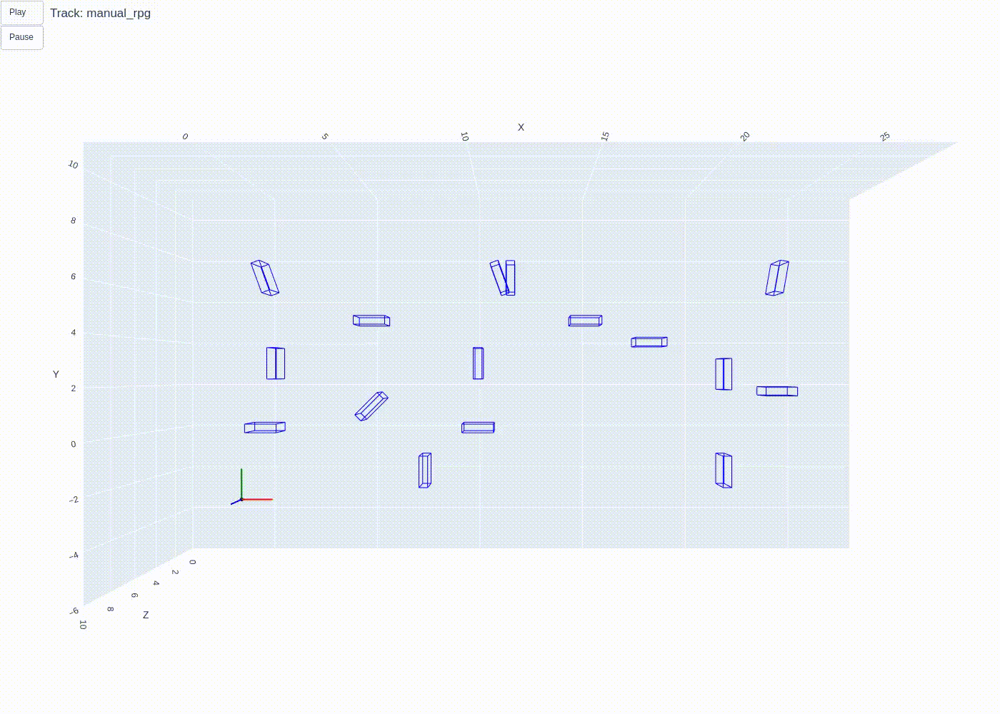
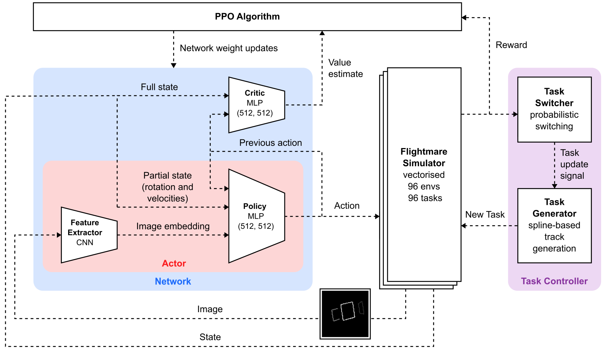

# 📌 Zero-Shot Generalisation with Reinforcement Learning for Agile Drone Flight

## 📖 Overview
Reinforcement Learning (RL) has unlocked new levels of capability for autonomous drone racing. However, it falls short on zero-shot generalisation (ZSG), as learned controllers typically cannot successfully race on unseen tracks. We examine the problem of ZSG for autonomous drone racing, explore what contributes to improved generalisation, and propose a multi-task method that leverages parallelisation to train an RL agent capably of successful high-speed flight on complex unseen racetracks. Our approach outperforms the state-of-the-art for RL drone racing generalisation by a factor of 7.4, while only increasing laptimes by 15.8% on average. We demonstrate this both in simulation and by flying racetracks in the real world. We then extend this approach to pixel-based input training an end-to-end controller that demonstrates, for the first time, vision-based ZSG for high-speed autonomous drone racing.

This was my [Master's Thesis](rpg_thesis_final.pdf) with the Robotics and Perception Group at the University of Zürich.

## 🎯 Key Features
- 🔹 Comprehensive end-to-end reinforcement learning pipeline enabling flight from pixels with zero-shot generalisation
- 🔹 Results validated with real-world deployment
- 🔹 Significant improvement over state-of-the-art

## 📊 Images

