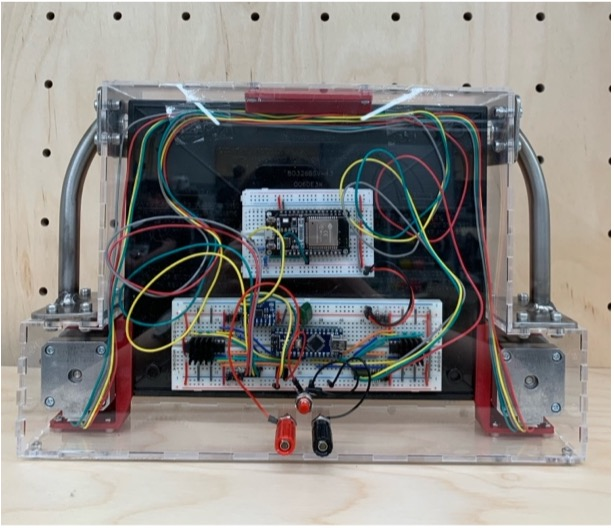
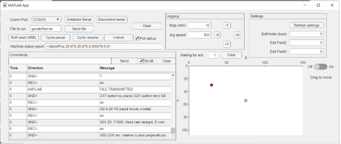

# 📌 CNC Etch-A-Sketch Home Assistant

## 📖 Overview
Intelligent smart home device displaying real time information such as time and the local weather forecast. Built around the famous (and beloved) Etch-A-Sketch toy rather than a conventional display. Integrated 2D CNC plotter to “draw” information on the Etch-A-Sketch

## 🎯 Key Features
- 🔹 Backend MATLAB application with full-featured GUI to provide information and control via Bluetooth  
- 🔹 Onboard motion controller and geared stepper motor drivetrain  
- 🔹 Integrated accelerometer to provide motion-based control and interaction  

## 📊 Images

