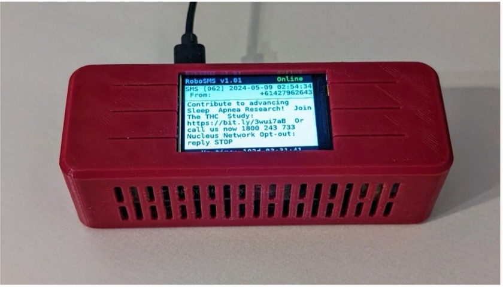

# 📌 Automated Phone Spoofing Modem for Global Access

## 📖 Overview
Device that uses a 5G modem and raspberry pi to spoof a mobile phone, which allows my Australian phone number to receive messages and phone calls and forwards them to me (for free) over the internet. With this, I can keep use my Australian phone number internationally without having to pay for an international phone plan.

## 🎯 Key Features
- 🔹 Forwards relevant information including SMS’s and missed calls to me by email (voicemail forwarding is a work in progress)  
- 🔹 Custom UI for setup and configuration with onboard controls  
- 🔹 Interacts with the network exactly as if it were my real mobile phone  
- 🔹 Built around a Raspberry Pi Zero W and contains a full-feature 4G mobile modem  

## 📊 Images

