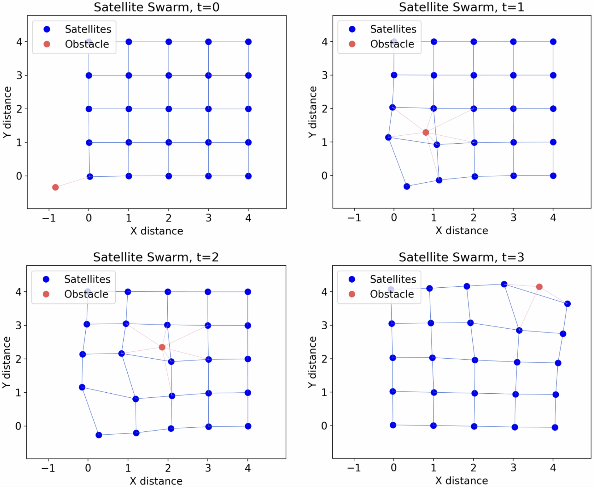

# 📌 Low-Cost Distributed Control for Satellite Collision Avoidance

## 📖 Overview
There is a huge push to create increasingly capable satellite constellations with increasingly small and low-cost satellites. We address these seemingly contradictory desires by proposing a novel satellite position controller with low runtime computational complexity that, for large swarms of satellites, nonetheless displays complex collision avoidance manouevring. 

For detailed information and the relevant proofs, please see [the paper that we wrote about it](satellites.pdf).

This project was the final component of Advanced Topics in Control at ETH Zürich.

## 🎯 Key Features
- 🔹 Novel satellite position controller developed  
- 🔹 Stability and convergenced proven   
- 🔹 Extremely low computation cost with complex emergent behaviour in large satellite constellations   

## 📊 Images

