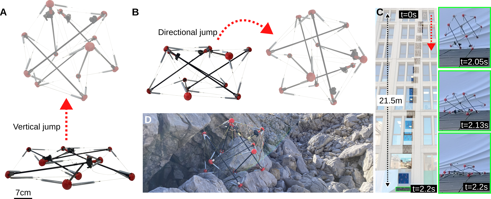
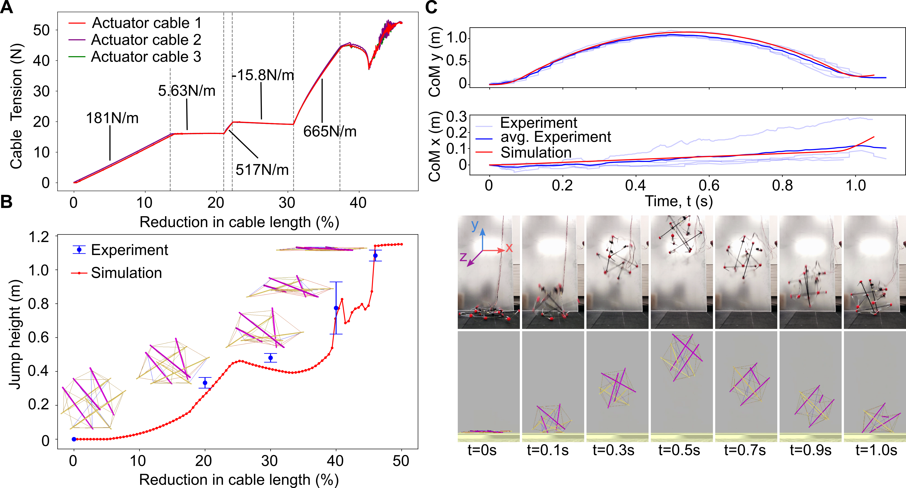

# 📌 High Jumping Tensegrity Robot for Space Exploration

## 📖 Overview
The growing interest in exploring other planets calls for innovative robotic systems capable of deploying to and traversing challenging space environments. While wheeled rovers have traditionally fulfilled this role, they face limitations, including configuration dependence (e.g., requiring an upright orientation), susceptibility to impacts, and difficulty overcoming obstacles larger than their wheel radius. Tensegrity-based robotics presents a promising alternative for future rovers. These lightweight, compliant structures offer compactability, adjustable stiffness, and the ability to absorb impacts without damage. Moreover, their unique form factor naturally protects scientific payloads.

This project develops a tensegrity robot that utilizes structural deformation for jumping locomotion. Through first- principles analyses, simulations, lab experiments, and field tests in a planetary analog environment, we demonstrate a robot capable of vertical jumps of 1.18m (1.93 body lengths), directional jumps covering horizontal distances up to 0.59m (0.97 body lengths), and surviving falls from heights of 21.5m (35.2 body lengths). The robot can also reduce its occupied volume by more than 4x without sustaining damage. This highlight the potential of jumping tensegrity robots as robust, versatile platforms for next-
generation space exploration.

For detailed information, please see [the report that I wrote about it](tensegrity_robot_report.pdf), and the [paper that we are publishing about our findings]() (NOTE: I've taken the paper down while it's under review and will provide an updated link once it is published)

## 🎯 Key Features
- 🔹 Comprehensive simulation of built for the development of the robot and locomotion strategies  
- 🔹 Robust high force-to-weight ratio actuators with integrated clutch mechanism created  
- 🔹 Prototyping, characterising, and analysing of a novel robot

## 📊 Images
Note: I've pulled these figures from the upcoming paper, so stay tuned for more information on our findings  

